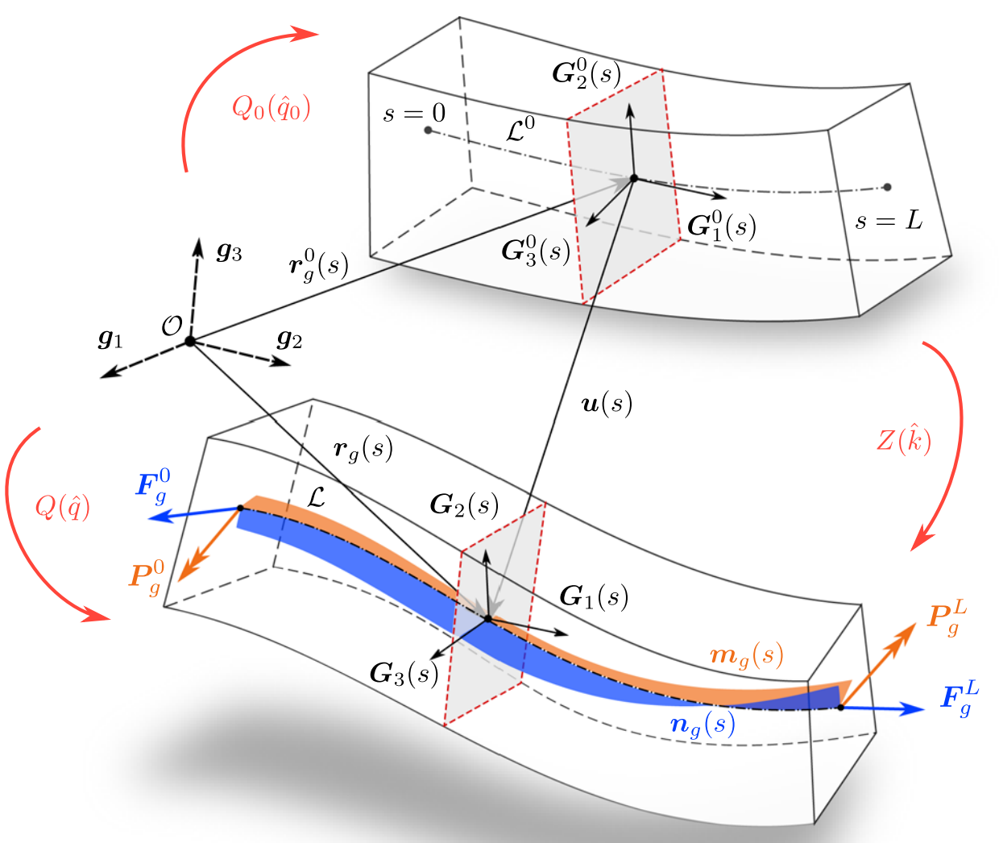

## 1. 1. Discretize of beam elements
Improving Timoshenko's Model Represented by Euler Angles.


### 1.1. Representation using quaternions
Since NSK uses quaternions to handle posture, we will model the quaternion representation in this program as well. Although there is an idea to convert Euler angles and quaternions for each calculation, we will use the direct quaternion method this time because it seems to be computationally expensive and there are already previous studies.

#### 1.1.1. Why quaternions?
Light computational cost. Gimbal lock does not occur.

|                 | Parameters | Memory | Handling | Notes                                                                   |
|-----------------|------------|--------|----------|-------------------------------------------------------------------------|
| Quaternion      | 4          | 0.5    | 1        | Has a good balance of abilities                                         |
| Eular           | 3          | 1      | 0        | The gradient per unit attitude change differs depending on the attitude |
| Rotation Matrix | 9          | 0      | 0.5      |                                                                         |


```python
import numpy as np


```


```python


```

#### 1.1.2. Previous research
Lolić, Damjan, Dejan Zupan, and Miha Brojan. "A consistent strain-based beam element with quaternion representation of rotations." Computational Mechanics (2020): 1-16.





```python

```
