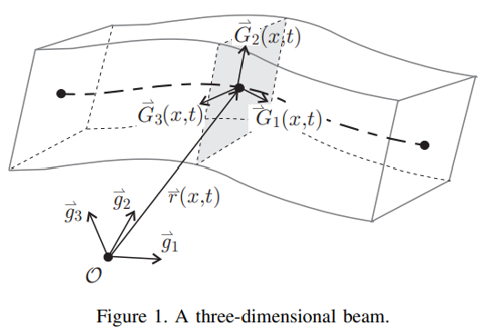
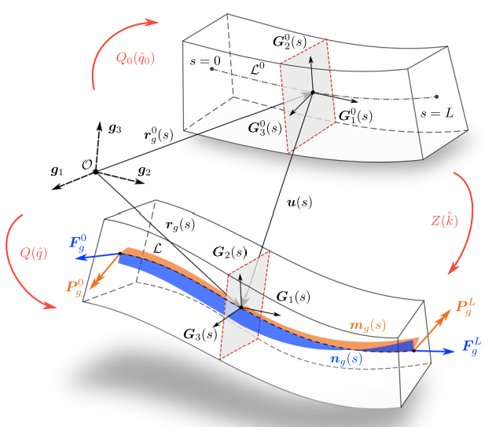

## 1. Discretize of beam elements
Improving Timoshenko's Model Represented by Euler Angles.


### 1.1. Representation using quaternions
Since NSK uses quaternions to handle posture, we will model the quaternion representation in this program as well. Although there is an idea to convert Euler angles and quaternions for each calculation, we will use the direct quaternion method this time because it seems to be computationally expensive and there are already previous studies.

#### 1.1.1. Why quaternions?
Light computational cost. Gimbal lock does not occur.

|                 | Parameters | Memory | Handling | Notes                                                                   |
|:---------------:|:----------:|:------:|:--------:|:-----------------------------------------------------------------------:|
| Quaternion      | 4          | 0.5    | 1        | Has a good balance of abilities                                         |
| Eular           | 3          | 1      | 0        | The gradient per unit attitude change differs depending on the attitude |
| Rotation Matrix | 9          | 0      | 0.5      |                                                                         |


```python
import numpy as np  # The next command is required: "pip install -U numpy"
import quaternion   # The next command is required: "pip install numpy-quaternion"

```

#### Simple Example

Make $q_0$ which means $60^o(= \frac{\pi}{3})$ degree rotation around the $z(=\begin{bmatrix} 0\\0\\1\end{bmatrix})$ axis.


```python
q0 = quaternion.from_rotation_vector(np.array([0, 0, 1]) * np.pi / 3)
print(q0)
```

    quaternion(0.866025403784439, 0, 0, 0.5)
    

$$
q_0 = \begin{bmatrix} \cos \frac{\theta}{2}\\ \sin \frac{\theta}{2} \begin{bmatrix} x\\y\\z \end{bmatrix} \end{bmatrix} = \begin{bmatrix} \cos \frac{60^0}{2}\\ 0 \\ 0 \\ \sin \frac{60^0}{2} \end{bmatrix} = \begin{bmatrix} \frac{\sqrt{3}}{2}\\ 0 \\ 0 \\ \frac{1}{2} \end{bmatrix}
$$

If we use this quaternion to calculate the rotation, we get this result.


```python
print(quaternion.rotate_vectors(q0, np.array([1, 0, 0])))
print(quaternion.rotate_vectors(q0, np.array([0, 1, 0])))
print(quaternion.rotate_vectors(q0, np.array([0, 0, 1])))

```

    [0.5       0.8660254 0.       ]
    [-0.8660254  0.5        0.       ]
    [0. 0. 1.]
    

$$
q_0 \otimes \begin{bmatrix} 1\\0\\0\end{bmatrix}=\begin{bmatrix} \frac{1}{2}\\\frac{\sqrt{3}}{2}\\0\end{bmatrix}, 
q_0 \otimes \begin{bmatrix} 0\\1\\0\end{bmatrix}=\begin{bmatrix} - \frac{\sqrt{3}}{2}\\ \frac{1}{2}\\0\end{bmatrix}, 
q_0 \otimes \begin{bmatrix} 0\\0\\1\end{bmatrix}=\begin{bmatrix} 0\\  0\\ 1 \end{bmatrix}
$$


#### 1.1.2. Previous research

Two types of modeling of beams by quaternions have been presented by the same laboratory.

|Kinematically Exact Beam Finite Elements Based on Quaternion Algebra (2014)|A consistent strain-based beam element with quaternion representation of rotations (2020)|
|:---:|:---:|
|||
|Eva Zupan, Miran Saje, **Dejan Zupan**|Damjan Loli, **Dejan Zupan**, Miha Brojan|
|University of Ljubljana|University of Ljubljana|
|Simple|Complex|
|displacement-based|strain-based|
|12 DOFs per element|26 DOFs per element|
|**to small shear deformations**|to larger shear deformations|

In order to deal with the deformation of the ballscrew this time, we do not need to consider "larger shear deformations", so I will deal with the **2014 model**.


#### Beam Model

input:

$
p=0...N+1,
\chi_p,
r_g(\chi_p),
\hat{q}(\chi_p)
$

parameter:

$
\mathscr C _N = \begin{bmatrix} EA_1 & 0 & 0 \\ 0 & GA_2 & 0 \\ 0 & 0 & GA_3 \end{bmatrix} \gamma _G(\chi _k),
\mathscr C _M = \begin{bmatrix} GJ_1 & 0 & 0 \\ 0 & EJ_2 & 0 \\ 0 & 0 & EJ_3 \end{bmatrix} \kappa _G(\chi _k)
$

local variable:

$
k=1...N,
n_g(\chi_k),
\hat{m}_g(\chi_k),
N_g(\frac{L}{2}),
M_g(\frac{L}{2})
$

$
r'_g(\chi_k) \approx \frac{r_g(\chi_{k + 1}) - r_g(\chi_{k - 1})}{2} \frac{L}{N + 1},
r'_g(\chi_k) \approx \frac{r_g(\chi_{k + 1}) - r_g(\chi_{k - 1})}{2} \frac{L}{N + 1}
$

$
\gamma _G(\chi _k) = \left[ \hat{q}^*(\chi_k) \circ \hat r' _g(\chi _k) \circ \hat{q}(\chi_k) \right] _{\mathbb{R}^3},
\kappa _G(\chi _k) = 2 \left[ \hat{q}^*(\chi_k) \circ \hat{q}'(\chi_k) \right] _{\mathbb{R}^3}
$

output (k):

$
\left[\hat{q}(\chi_k) \circ \mathscr {\hat C} _N \circ \hat{q}^*(\chi_k) \right]' _{\mathbb{R}^3} + n_g(\chi_k) = 0
$

$
\left( \hat{q}(\chi_k) \circ \mathscr {\hat C} _M \circ \hat{q}^*(\chi_k) \right)' + \hat{m}_g(\chi_k) - N_g(\frac{L}{2})\times r'_g(\chi_k)  + \int_{\chi_k}^{L / 2} n_g(\chi) \,d\chi \times r'_g(\chi_k) = 0
$

output:

$
F_g(0) + N_g(\frac{L}{2}) + \int_{0}^{L / 2} n_g(\chi) \,d\chi = 0
$

$
P_g(0) + M_g(\frac{L}{2}) - N_g(\frac{L}{2}) \times \left( r_g(\frac{L}{2}) - r_g(0) \right) - \int_{0}^{L / 2} n_g(\chi) \times \left(r_g(\chi) - r_g(0) \right) \,d\chi + \int_{0}^{L / 2} m_g(\chi) \,d\chi = 0
$

$
F_g(L) - N_g(\frac{L}{2}) + \int_{L / 2}^{L} n_g(\chi) \,d\chi = 0
$

$
P_g(L) - M_g(\frac{L}{2}) - N_g(\frac{L}{2}) \times \left( r_g(L) - r_g(\frac{L}{2}) \right) + \int_{L / 2}^{L} n_g(\chi) \times \left(r_g(L) - r_g(\chi) \right) \,d\chi + \int_{L / 2}^{L} m_g(\chi) \,d\chi = 0
$


```python

```

#### hoge

$\delta \hat \kappa _G = 2 \delta \hat q ^* \circ \hat q' + 2 \hat q ^* \circ \delta \hat q'$


```python
def calc_delta_kappaG(q0, q1):
    return 1
```

$
y ^{[n + 1]} = y ^{[n]} + \delta y
$

$
r_g ^{p [n + 1]} = r_g ^{p [n]} + \delta r ^p _g \qquad(p =0,..., N+1)
$

$
N_g(\chi) = N_g(\frac{L}{2}) + \int_{\chi}^{L / 2} n_g \,d\xi
$

$
M_g(\chi) = M_g(\frac{L}{2}) + \int_{\chi}^{L / 2} m_g \,d\xi - \int_{\chi}^{L / 2} N_g \times r'_g \,d\xi
$


```python

```
