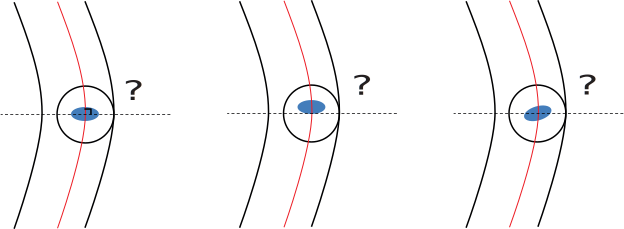

# 3.1. Contact with Spiral Torus

1. Does the contact point between the ball and the Spiral Torus lie in the plane of the Frenet coordinate system, and does the long diameter of the contact ellipse also lie in the plane?



2. Where does the force balance in a ball sandwiched between two Spiral Torus? 


These questions will be examined.

## 3.1.1. Create a mesh on the Spiral Torus and measure the distance
Create a mesh on top of the Spiral Torus and measure the distance to a point.


```python
from IPython.display import set_matplotlib_formats
set_matplotlib_formats('svg')

```


```python
import numpy as np
import matplotlib.pyplot as plt
from matplotlib import cm
from matplotlib.collections import LineCollection

```


```python
import sys
import pathlib
import os
sys.path.append(str(pathlib.Path(os.path.abspath('')).resolve().parent.parent))
from IPython.display import display, HTML

from _9_Mechanics.Spiral import Spiral
from _9_Mechanics.Tribology import Tribology

TB = Tribology()

```


```python
R = 6.35 / 2
Rg = R * 1.08
dR = R * 0.08 / np.sqrt(2)
PCR = 20.875
SP0 = Spiral(alp=np.deg2rad(0e-3), l=10.0, r=PCR, eta=np.array([[-dR, -dR],[0,0]]), R=np.array([Rg, 0]))

```


```python
def plot_2d_mesh(x, y, xl='', yl=''):
    fig = plt.figure()
    ax = fig.add_subplot(111)
    plt.scatter(x, y)
    ax.set_aspect('equal', adjustable='box')

    segs1 = np.stack((x,y), axis=2)
    segs2 = segs1.transpose(1,0,2)
    plt.gca().add_collection(LineCollection(segs1))
    plt.gca().add_collection(LineCollection(segs2))
    plt.xlabel(xl)
    plt.ylabel(yl)
    return ax

```


```python
th = np.deg2rad(np.linspace(0, 1080, int(1e2)))
alp = np.deg2rad(np.linspace(0, 360, int(6)))

xyz = SP0.get_mesh(th, alp, 0)

fig = plot_2d_mesh(xyz[:,:,0], xyz[:,:,1], 'x', 'y')
fig = plot_2d_mesh(xyz[:,:,0], xyz[:,:,2], 'x', 'z')
plt.show()

```


    

    


    

    


Assume the surface of a ball screw and create a mesh at a contact angle of 45 degrees.


```python
th = np.deg2rad(np.linspace(-1.0, 1.0, int(1e1)))
alp = np.deg2rad(np.linspace(40, 50, int(1e1)))

xyz = SP0.get_mesh(th, alp, 0)
print('dth = '  + str(np.linalg.norm(xyz[1,0,:] - xyz[0,0,:])) + ' [mm]')
print('dalp = ' + str(np.linalg.norm(xyz[0,1,:] - xyz[0,0,:])) + ' [mm]')

fig = plot_2d_mesh(xyz[:,:,0], xyz[:,:,1], 'x', 'y')
fig = plot_2d_mesh(xyz[:,:,1], xyz[:,:,2], 'y', 'z')
fig = plot_2d_mesh(xyz[:,:,2], xyz[:,:,0], 'z', 'x')
plt.show()
```

    dth = 0.07174105369575173 [mm]
    dalp = 0.06649600252244033 [mm]
    


    

    


    

    


    

    


```python
th = np.deg2rad(np.linspace(-1.0, 1.0, int(1e2)))
alp = np.deg2rad(np.linspace(40, 50, int(1e2)))

xyz = SP0.get_mesh(th, alp, 0)

x_ball = np.array([0., PCR, 0.])
R_ball = R + 1e-3

Disp_xyz = x_ball - xyz
Disp = R_ball - np.sqrt(np.sum(np.square(Disp_xyz), 2))
Disp[Disp<0.0] = 0.0

plt.imshow(Disp, cmap=cm.jet, extent=np.rad2deg([alp[0], alp[-1], 1e3 *th[0], 1e3 *th[-1]]), aspect='auto')
plt.xlabel('Contact angle: α [deg]')
plt.ylabel('Spiral angle: θ [mdeg]')
plt.colorbar()
plt.show()

Th, Alp = np.meshgrid(th, alp)
fig, ax = plt.subplots(subplot_kw={"projection": "3d"})
surf = ax.plot_surface(np.rad2deg(Alp), 1e3 * np.rad2deg(Th), Disp.T, cmap=cm.jet)
ax.set_xticks([40, 45, 50])
ax.set_xlabel('Contact angle: α [deg]')
ax.set_ylabel('Spiral angle: θ [mdeg]')
plt.show()

```


    

    


    

    


```python
x_mean = alp @ np.mean(Disp, axis=0) / np.mean(Disp, axis=0).sum()
y_mean = th @ np.mean(Disp, axis=1) / np.mean(Disp, axis=1).sum()

plt.imshow(Disp, cmap=cm.jet, extent=np.rad2deg([alp[0], alp[-1], 1e3*th[0], 1e3*th[-1]]), aspect='auto')
plt.axvline(x=np.rad2deg(x_mean), color='black', linestyle='--')
plt.axhline(y=1e3*np.rad2deg(y_mean), color='black', linestyle='--')
plt.xlabel('Contact angle: α [deg]')
plt.ylabel('Spiral angle: θ [mdeg]')
plt.colorbar()
plt.show()

print('Center Contact angle: α = ' + str(np.rad2deg(x_mean)) + ' [deg]')
print('Center Spiral angle:  θ = ' + str(1e3 * np.rad2deg(y_mean)) + ' [mdeg]')
```


    

    


    Center Contact angle: α = 44.995508348703204 [deg]
    Center Spiral angle:  θ = -0.0006650266603639604 [mdeg]
    

## 3.1.1. Conclusion

- The distance between the surface of the spiral torus and some arbitrary point was determined. Here we do not deal with algebraic calculations, but only one representative example.
- The intersection point of the spiral tube and the ball can be well represented on a plane perpendicular to the center of the spiral.
- The spiral is the simplest mathematical expression with curvature and tortuosity. The fact that the center of the spiral, the center of the ball, the point of contact, and the length diameter of the contact ellipse all ride on the same plane suggests that in order to consider contact with a torus (here meaning the direct product set of the unit circumference), we must first find the center of the torus.

## 3.1.2. Force balance between two Spiral Torus

a


```python
SP1 = Spiral(alp=np.deg2rad(1e-1), l=10.0, r=PCR, eta=np.array([[-dR, -dR],[-dR, dR]]), R=np.array([Rg, Rg]))
SP2 = Spiral(alp=np.deg2rad(-1e-1), l=10.0, r=PCR, eta=np.array([[dR, dR],[dR, -dR]]), R=np.array([Rg, Rg]))

rho = 7.9e-3 # [g/mm^3]
Ball_m = 4/3 * np.pi * R**3 * rho # [g]
Ball_r_inv = 1.0 / R
v_ball = np.zeros(3)
zeta = 0.3
xv_ball = np.concatenate([x_ball, v_ball])
E_Reduced = 231e3 # [N/mm^2]

```


```python
def va_ball(xv_ball, t, R, SP1, SP2, Ball_r_inv, zeta, E_Reduced):
    x_ball = xv_ball[:3]
    v_ball = xv_ball[3:]
    
    cos_sin1, dx1, exyz1 = SP1.get_contact(x_ball, R, 0)
    SP1_r_inv = SP1.get_rho(cos_sin1[0], 0)
    R_Reduced1 = 1.0 / (Ball_r_inv + SP1_r_inv)
    k1, a1, b1 = TB.BrewHamrock(R_Reduced1[0], R_Reduced1[1], dx1, E_Reduced)
    v1 = v_ball.dot(exyz1)
    F1 = - TB.Tsuji(k1, zeta, Ball_m, v1, dx1) * exyz1

    cos_sin2, dx2, exyz2 = SP2.get_contact(x_ball, R, 0)
    SP2_r_inv = SP2.get_rho(cos_sin2[0], 0)
    R_Reduced2 = 1.0 / (Ball_r_inv + SP2_r_inv)
    k2, a2, b2 = TB.BrewHamrock(R_Reduced2[0], R_Reduced2[1], dx2, E_Reduced)
    v2 = v_ball.dot(exyz2)
    F2 = - TB.Tsuji(k2, zeta, Ball_m, v2, dx2) * exyz2

    a_ball = (F1 + F2) / Ball_m
    
    return np.concatenate([v_ball, a_ball])

```


```python
from scipy.integrate import odeint
t = np.linspace(0, 0.2, 1000)
sol = odeint(va_ball, xv_ball, t, args=(R, SP1, SP2, Ball_r_inv, zeta, E_Reduced))

```


```python
fig, ax = plt.subplots()
ax.plot(t, sol[:,1])
```


    [<matplotlib.lines.Line2D at 0x2835b8b0fd0>]


    

    


```python
x_end = sol[-1,:3]

eta1 = SP1.to_eta2(x_end)
xyz2eta1 = SP1.get_xyz2eta(eta1[0])
t1 = xyz2eta1.T @ np.array([1.0, 0.0, 0.0])

eta2 = SP2.to_eta2(x_end)
xyz2eta2 = SP2.get_xyz2eta(eta2[0])
t2 = xyz2eta2.T @ np.array([1.0, 0.0, 0.0])

np.rad2deg(np.arccos(t1.dot(t2)))

```


    0.001152503033434576


```python
cos_sin1, dx1, exyz1 = SP1.get_contact(x_end, R, 0)
cos_sin2, dx2, exyz2 = SP2.get_contact(x_end, R, 0)

np.rad2deg(np.arccos(-exyz1.dot(exyz2)))

```


    0.0008110952990346056


```python
b1 = np.cross(t1, exyz1)
b2 = np.cross(t2, exyz2)

np.rad2deg(np.arccos(- b1.dot(b2)))

```


    0.0008235305157998825


```python

```


```python

```
